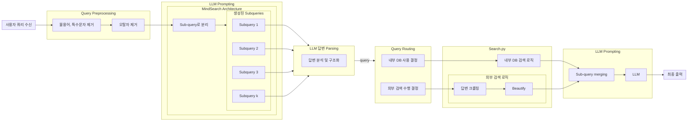

## Introduction

## Contribution
- 크롤링 로직 작성

## Agentic AI Implementation Process

```mermaid
flowchart LR
    subgraph 1["사용자 쿼리 수신"]
    end

    subgraph 2["Query Preprocessing"]
        2a["불용어, 특수문자 제거"]
        2b["오탈자 제거"]
    end

    subgraph 3["LLM Prompting"]
        subgraph 3a["MindSearch Architecture"]
            3aa["Sub-query로 분리"]
            subgraph Subqueries["생성된 Subqueries"]
                3ab["Subquery 1"]
                3ac["Subquery 2"]
                3ad["Subquery 3"]
                3ae["Subquery k"]
            end
        end
    end

    subgraph 4["LLM 답변 Parsing"]
        4a["답변 분석 및 구조화"]
    end

    subgraph 5["Query Routing"]
        5a["내부 DB 사용 결정"]
        5b["외부 검색 수행 결정"]
    end

    subgraph 6["Search.py"]
        6a["내부 DB 검색 로직"]
        subgraph 6b["외부 검색 로직"]
            7["답변 크롤링"]
            8["Beautify"]
        end
    end

    subgraph 9["LLM Prompting"]
            9a["Sub-query merging"]
            9b["LLM"]
    end


    subgraph 10["최종 출력"]
    end

    %% Connections
    1 --> 2a --> 2b
    2b --> 3aa
    3aa --> Subqueries
    3ab --> 4
    3ac --> 4
    3ad --> 4
    3ae --> 4
    4 -- query --> 5
    5a --> 6a
    5b --> 7 --> 8

    6a --> 9a
    8 --> 9a

    9a --> 9b --> 10

```

## TL;DR

